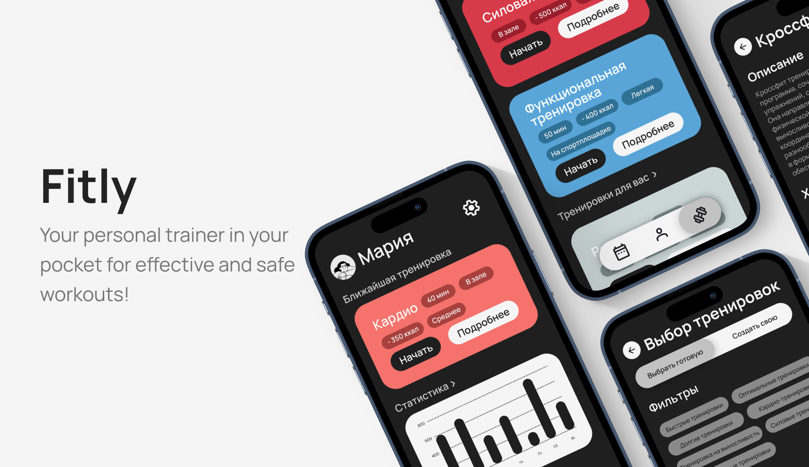

# Fitly (Backend)

Fitly Backend is the server-side part of the Fitly application, developed with Ruby on Rails. It provides an API for a mobile application built with React Native, designed for personalized workout selection, custom program creation, workout tracking, and user progress monitoring.

# Requirements

- Ruby 3.3.0
- Ruby on Rails 7.1
- PostgreSQL

# Deployment and Launch
### Local launch

1.  Cloning a repository
```bash
git clone git@github.com:eeatoe/Fitly.git && cd Fitly
```

2. Installing dependencies
```bash
bundle install
```

3. Preparing the Database
```bash
rails db:create db:migrate db:seed
```

4. Starting the Server (The server will start at the address: http://localhost:3000/)
```bash
rails server
```

### Running tests

```bash
rspec
```
